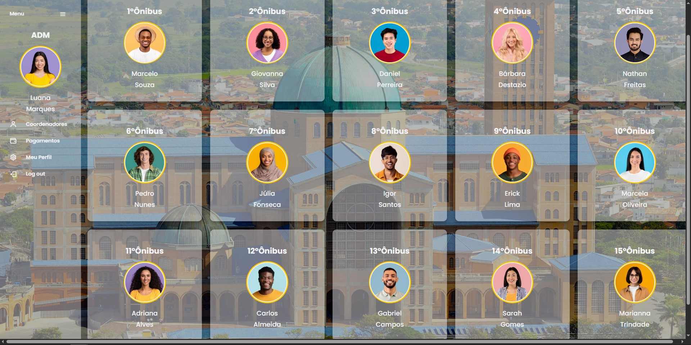
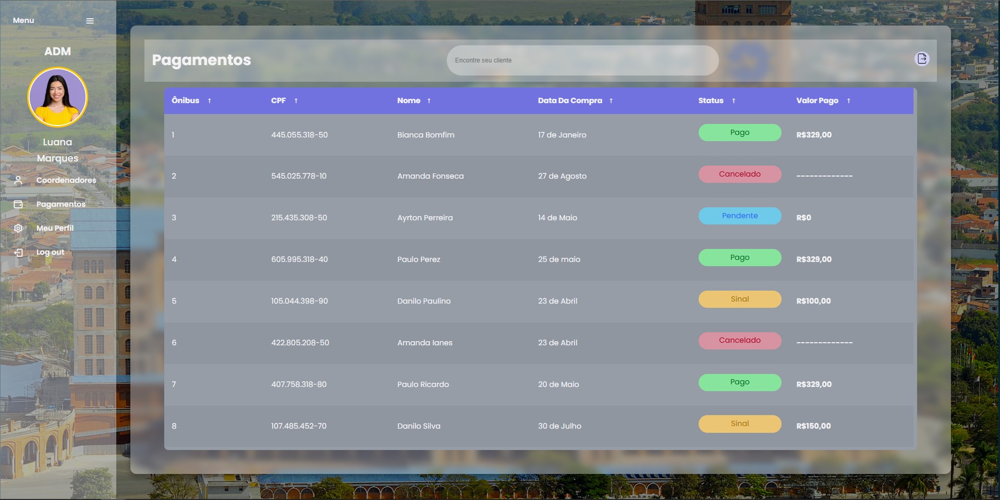
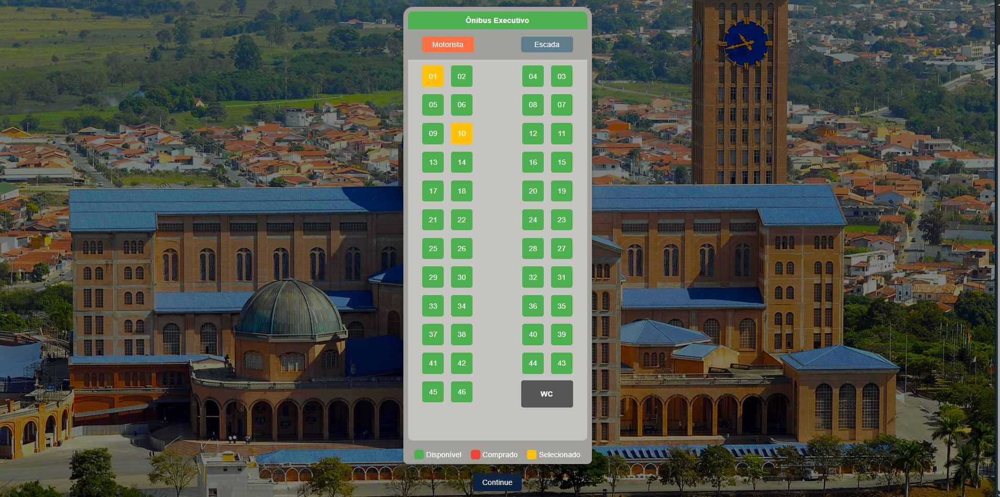

# 🚌 Gestão de Viagens para Aparecida — Front-end

## 🎯 Sobre o Projeto  
O **Sistema de Viagens para Aparecida do Norte** é um projeto acadêmico desenvolvido com o objetivo de **gerenciar de forma prática e eficiente viagens de ônibus para uma paróquia**, incluindo funcionalidades como:  

- Cliente pode escolher com qual coordenador irá viajar;  
- Controle de vagas disponíveis em cada ônibus;  
- Controle e registro de pagamentos;  
- Interface intuitiva e moderna para facilitar o uso por administradores e usuários.  

> ⚠️ **Observação:** Este repositório contém **apenas a parte do front-end** do projeto. Outras partes, como back-end e banco de dados, fazem parte do projeto completo, mas não estão incluídas aqui.

---

## 🎨 Meu Papel no Projeto (Front-end / Protótipo)
Fui responsável por toda a parte de **implementação do front-end**, incluindo:

- Criação de todas as telas e componentes visuais em código (HTML, CSS, JavaScript);  
- Definição da **identidade visual** e **fluxo de navegação**;  
- Protótipo visual das telas no Figma para documentação e apresentação da interface.

> 💡 Nota: As telas do Figma foram geradas a partir do código do front-end, ou seja, o protótipo reflete fielmente as interfaces desenvolvidas.

---

## 🧑‍💻 Telas
🔗 **Acesse o protótipo completo:** [Clique aqui para visualizar no Figma](#)  

### 📸 **Exemplos de Telas**
| Tela Coordenadores | Painel de Pagamentos | Tela de Reservas |
|------------------|--------------------|-----------------|
|  |  |  |

---

## 🎬 Vídeo do Protótipo em Ação
🎥 **Em breve**  

---

✨ *Desenvolvido com dedicação durante as aulas de laboratório web (FATEC).
